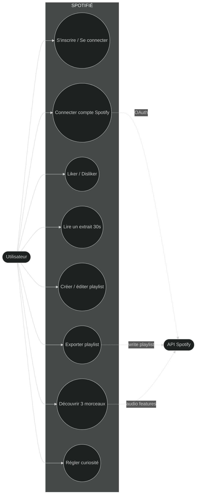
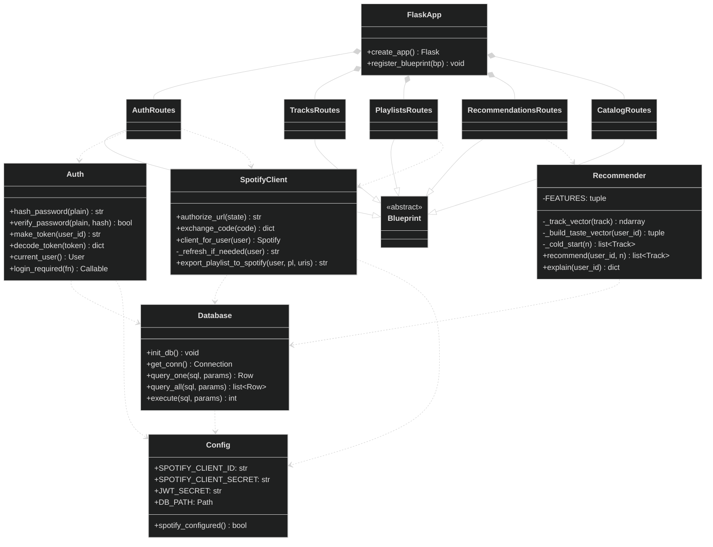
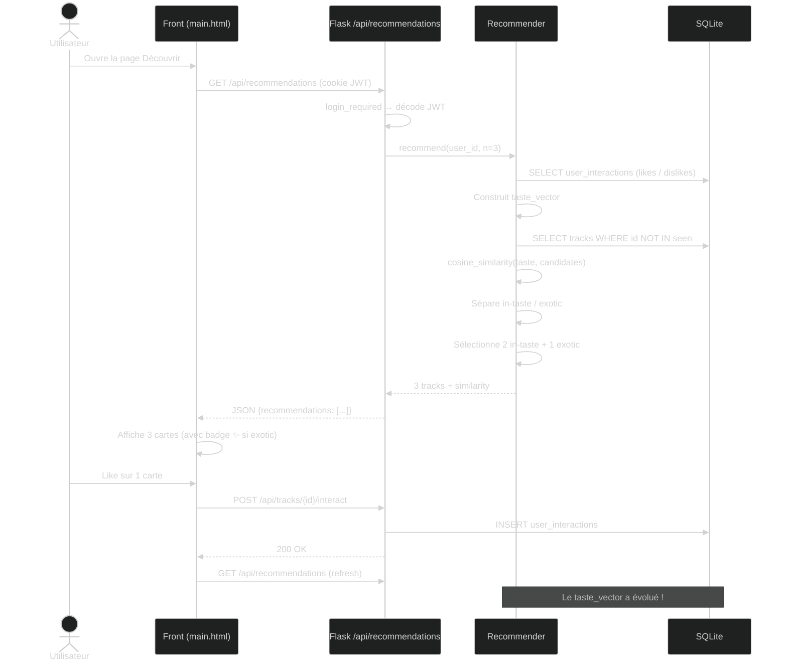
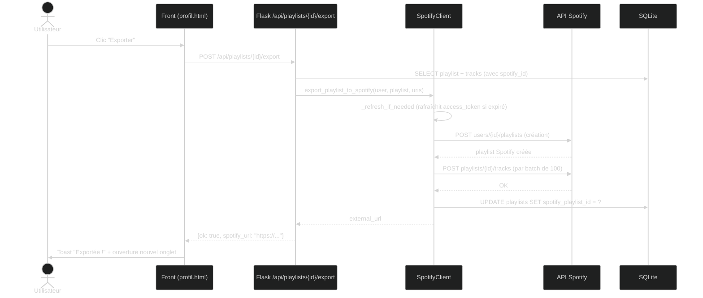

# Diagrammes UML — SPOTIFIÉ

Ce document contient les diagrammes UML demandés (4 pts du barème : « Traduire
un besoin fonctionnel en modèle de données »). Tous les diagrammes sont en
[Mermaid](https://mermaid.js.org/) — visualisables sur GitHub, dans VS Code
avec l'extension Mermaid, ou sur https://mermaid.live.

---

## 1. Diagramme de cas d'utilisation



---

## 2. Diagramme de classes (POO backend)



---

## 3. Modèle relationnel (5 tables)

```mermaid
erDiagram
    USERS ||--o{ PLAYLISTS : "crée"
    USERS ||--o{ USER_INTERACTIONS : "génère"
    TRACKS ||--o{ PLAYLIST_TRACKS : "appartient à"
    TRACKS ||--o{ USER_INTERACTIONS : "concerne"
    PLAYLISTS ||--o{ PLAYLIST_TRACKS : "contient"

    USERS {
        INTEGER id PK
        TEXT email UNIQUE
        TEXT password_hash
        TEXT display_name
        TEXT spotify_id
        TEXT spotify_access_token
        TEXT spotify_refresh_token
        INTEGER spotify_token_expires_at
        REAL exotic_factor
        TIMESTAMP created_at
    }

    TRACKS {
        INTEGER id PK
        TEXT spotify_id UNIQUE
        TEXT title
        TEXT artist
        TEXT album
        TEXT preview_url
        TEXT image_url
        INTEGER duration_ms
        INTEGER popularity
        TEXT genre
        REAL danceability
        REAL energy
        REAL valence
        REAL tempo
        REAL acousticness
        REAL instrumentalness
        REAL speechiness
        REAL loudness
    }

    PLAYLISTS {
        INTEGER id PK
        INTEGER user_id FK
        TEXT name
        TEXT description
        TEXT cover_url
        TEXT spotify_playlist_id
        TIMESTAMP created_at
        TIMESTAMP updated_at
    }

    PLAYLIST_TRACKS {
        INTEGER id PK
        INTEGER playlist_id FK
        INTEGER track_id FK
        INTEGER position
        TIMESTAMP added_at
    }

    USER_INTERACTIONS {
        INTEGER id PK
        INTEGER user_id FK
        INTEGER track_id FK
        TEXT action
        TIMESTAMP created_at
    }
```

---

## 4. Diagramme de séquence — recommandation



---

## 5. Diagramme de séquence — export playlist Spotify


